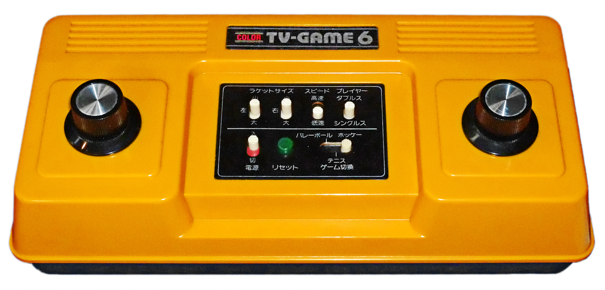

# Historia de Nintendo

## Introducción

Nintendo es una compañía de videojuegos japonesa. Fundada en 1889, al inicio fabricaban un juego de cartas llamado <em>hanafuda</em>; pero
desde los años 70 se dedican a desarrollar, publicar y promover consolas de videojuegos junto con su software. Desde ese entonces, Nintendo
ha sido reconocido como la desarrolladora de videojuegos más grande del y una de las compañías japonesas más valiosas. Sus franquicias más 
exitosas, <em>Mario</em> y <em>Pokémon</em>, son actualmente unas de las franquicias multimedia más valiosas de la historia del 
entretenimiento.

Las consolas de Nintendo han llegado a vender casi mil millones de copias en todo el mundo; la más exitosa siendo la Nintendo DS que vendió más
de 154 millones de copias, haciéndola la segunda consola más vendida de la historia de los videojuegos; justo detrás de la PlayStation 2 que logró
vender un poco más.

Desde los años 90, la mascota de Nintendo ha sido Mario, un fontanero italiano que tiene como objetivo rescatar a la princesa del Reino Champiñón.
Mario ha llegado a ser uno de los personajes ficticios más famosos; tan famoso que mucha gente que no ha jugado videojuegos es capaz de reconocer su
diseño icónico.

## Nintendo antes de los videojuegos

     

    <a href="https://en.wikipedia.org/wiki/Fusajiro_Yamauchi" target="_blank"><strong> &nbsp; Fusajiro Yamauchi</strong></a>

 

Nintendo fue fundada en el 23 de septiembre de 1889 por un artesano llamado Fusajiro Yamauchi en Kyoto. El nombre "Nintendo" se supone que significa
'deja la suerte al cielo', pero muchas personas están en desacuerdo porque no ha quedado claro su significado real hasta la fecha. En ese tiempo,
Nintendo producía cartas *hanafuda*, un juego de cartas japonés que era muy popular en esos años. Con el paso del tiempo, crecieron y crecieron
hasta llegar a ser la productora de cartas más grande de Japón. 

    

    <a href="https://en.wikipedia.org/wiki/Hiroshi_Yamauchi" target="_blank"><strong> &nbsp; Hiroshi Yamauchi</strong></a>

 

Nintendo fue un negocio familiar lidiado por la familia Yamauchi por casi toda su historia. No fue hasta 2002 cuando Satoru Iwata llegó a ser el primer 
presidente de Nintendo fuera de los Yamauchi. El último Yamauchi, llamado Hiroshi, fue el responsable en hacer que la compañía pase de fabricar cartas
a fabricas consolas de videojuegos. Él se volvió presidente en 1949. Las primeras décadas de su presidencia
consistieron en reestructurar la compañía y variar los productos que fabricaban. Algunos productos que producieron entre esos años fueron juegos de mesa
tradicionales como ajedrez, mahjong, go, entre otros. 

En 1970, Nintendo hizo historia cuando lanzó el primer juguete electrónico en la historia de Japón. El juguete consistía de una pistola de luz llamada 
**Beam Gun**; llegó a vender más de un millón de copias. Un año después, Nintendo colaboró con Magnavox para crear otra pistola de luz basada 
en la Beam Gun para su nueva consola de videojuegos, la Magnavox Odyssey. De ahora en adelante, Nintendo sólo se dedicará a fabricar electrónica, abandonando
totalmente la producción de cartas y juguetes.

## Las primeras consolas de Nintendo

### Color TV-Game

    

 

La primera consola de videojuegos lanzada por Nintendo es conocida como la *Color TV-Game*, únicamente disponible en Japón. La consola venía con seis versiones de
Pong integradas, haciéndola una consola dedicada porque ese era el único videojuego que se podía jugar. Siendo la consola más exitosa de su generación, la 
Color TV-Game llegó a vender más de tres millones de copias hasta que fue descontinuada en 1983; siendo el mismo año en que lanzaron su próxima consola.

### Family Computer

    

  
 

Después de haber tenido mucho éxito vendiendo la *Color TV-Game*, Nintendo lanzó la Family Computer en 1983, que luego estuvo disponible fuera de Japón dos años después.
Se llamó Nintendo Entertainment System(NES) en mercados internacionales. La Family Computer llegó a ser una de las consolas más influenciales de la historia de los 
videojuegos, con su catálogo de videojuegos que definieron el estándar para todas las demás desarrolladoras; muchos de estos estándares se siguen usando hasta la fecha.

Dentro de su catálogo están videojuegos como *Super Mario Bros.* y *The Legend of Zelda*, que iniciaron las franquicias más exitosas de Nintendo y han dejado un gran
legado. *Super Mario Bros.* en particular dio inicio a una de las franquicias más valiosas de todos los tiempos; y el protagonista Mario es tan famoso que hasta incluso
mucha gente que no ha jugado ni un sólo videojuego lo podrá reconocer sin ningún problema.

## Nintendo en los años 90 

### Super Famicom

    

 

Ahora que Nintendo ha logrado dominar el mercado de los videojuegos en Japón, lanzaron la Super Famicom en 1990. Se lanzó fuera de Japón un año después, con el nombre de *Super Nintendo Entertainment System*(SNES).  La Super Famicom es una consola de 16 bits que llegó a ser igual de exitosa que la Family Computer. Fue reconocida por
ser una de las consolas más potentes de su generación, con gráficos avanzados y una tarjeta de sonido capaz de replicar sonidos de instrumentos musicales reales.

La Super Famicom fue tan popular que continuó vendiendo muchas copias a finales de los años 90. Debido a esta gran demanda que continuaba, no fue descontinuada hasta 
2003. Vendió más de 49 millones de copias en todo el mundo, y actualmente es una de las consolas 'retro' más populares entre coleccionistas.

### Nintendo 64

    

 

Nombrada por su procesador de 64 bits, la Nintendo 64 fue la consola que logró explotar las cabezas de todos, con sus gráficos tridimensionales impresionantes que 
eran capaces de dibujar entornos más realistas que nunca antes. Lanzada en 1996, ha sido reconocida por tener unos de los mejores videojuegos de todos los tiempos
en su catálogo; desde *Super Mario 64* hasta *The Legend of Zelda: Ocarina of Time*. 

A pesar de ser más poderosa que su competencia, la *Playstation* de Sony, llego a vender mucho menos por varias razones. Por ejemplo, la Nintendo 64 seguía utilizando
cartuchos en lugar de CDs, lo cual limitaba mucho la cantidad de contenido que puede contener un juego. Además, los cartuchos costában mucho más dinero en fabricar y
era más complicado programar en ella. En total, la Nintendo 64 vendió 33 millones de copias, fracasando en Japón y Europa. Sólo llego a tener mucho éxico en América 
del norte, vendiendo más de 20 millones de copias ahí; más de la mitad del número total de ventas.

## Años 2000: La decadencia y vuelta al éxito.

### GameCube

    

 

Debido a que la Nintendo 64 no llegó a ser tan exitosa como sus consolas pasadas, fue descontinuada en 2002; seis años después de haber sido lanzada. Un año antes, en 
2001, lanzaron la Nintendo GameCube; una consola que competiría con la PlayStation 2 de Sony y la nueva Xbox de Microsoft. Nintendo, por primera vez en su historia,
abandona los cartuchos y comienza a distribuir sus videojuegos en discos Mini DVD. 

A diferencia de la PS2 y la Xbox, la GameCube no puede reproducir música y películas. Pero de todos modos fue bien recibida por los críticos. Pero por desgracia, volvió
a fracasar; esta vez vendiendo aún menos copias que la Nintendo 64. Fue entre estos años cuando Hiroshi Yamauchi se retiró y Satoru Iwata tomó su posición, haciéndolo el
primer presidente de Nintendo que no formaba parte de la familia del fundador.

### Wii

    

 

Ahora que Nintendo cambió de presidente, Satoru Iwata decidió cambiar la filosofía de la compañía. En lugar de fabricar las consolas más poderosas, él se enfoco en 
fabricar una de más bajos recursos que la competencia para que cueste menos dinero fabricarla y así será más accesible. Otra cosa que cambió en su filosofía es que 
ahora en vez de enfocarse a los fans de Nintendo, se enfocaron en una audiencia más casual. Una audiencia que no se haya familiarizado tanto con los videojuegos.

Pues esto lo lograron con la Wii. Esta consola fue diseñada para hacer que las personas que nunca han jugado un videojuego en su vida comiencen con su aventura en
el mundo gigante de los videojuegos. Y lo lograron, vendiendo más de 100 millones de copias en todo el mundo, haciéndola la consola de sobremesa más vendida de Nintendo
en su momento. La Wii actualmente es conocida por ser la plataforma de uno de los videojuegos más presentes en la cultura popular, *Wii Sports*.

## Años 2010: El punto más bajo y más alto de Nintendo en una década

### Wii U

    

 

Después del gran éxito que fue la Wii, Nintendo decidió que su próxima consola se enfoque en el mismo mercado casual que su última consola. Esta consola fue la Wii U, que salió en todo el mundo en 2012. Nintendo pensaba que iba a ser otra consola exitosa, pero desafortunadamente ese no fue el resultado. Debido a su marketing pobre y a la falta de interés en el mercado, sólo llegó a vender 13 millones de copias. Por cierto, el marketing fue tan pobre que mucha gente pensó que era tan sólo un accesorio para la Wii y no una consola totalmente diferente.

La primera mitad de los años 2010 fueron los años más decepcionantes de Nintendo. La Wii U vendió tan poco que hasta incluso muchas desarrolladoras de terceros como KONAMI ó ELECTRONIC ARTS casi no lanzaron juegos en ella y se enfocaron más en la PlayStation 4 y en la Xbox One. La consola también es conocida por tener uno de los catálogos más pobres de cualquier consola de Nintendo, con tan sólo 157 juegos en total en todas las regiones. Muchos de los videojuegos exclusivos fueron lanzados en su próxima consola.

### Nintendo Switch

Debido a que Nintendo se dio cuenta de que el mercado casual ya no está muy interesado en la Wii, decidieron cambiar su mentalidad de nuevo. Abandonando la de Iwata, lanzaron la nueva Nintendo Switch. Conocida por ser una consola de videojuegos híbrida; es decir, es portátil y de sobremesa a la vez. Actualmente la consola ha sido la más exitosa en la historia de Nintendo, quitándole ese puesto a la Wii con más de 150 millones de copias vendidas. 

De todas las consolas en la lista, esta es la única que aún no ha sido descontinuada por Nintendo. Se sigue fabricando hasta la fecha, y la gente la sigue comprando. Su catálogo de videojuegos es el más grande de la historia de Nintendo.